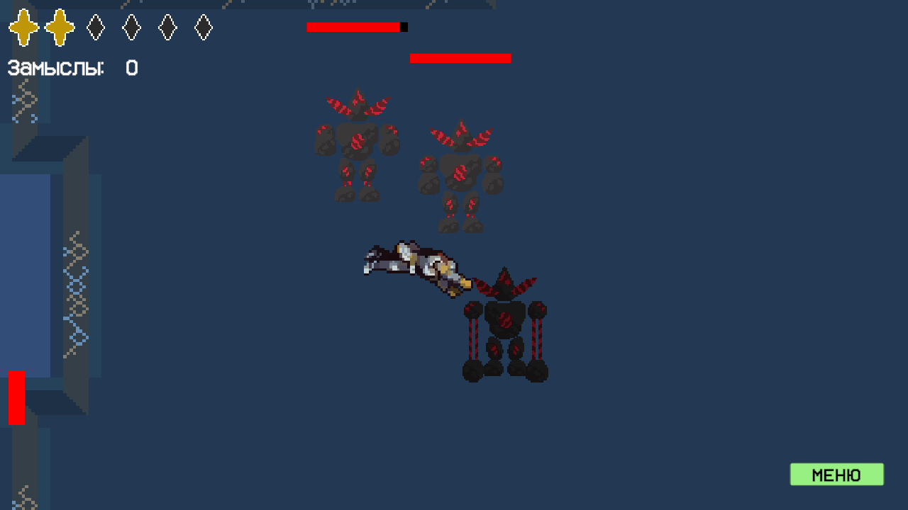
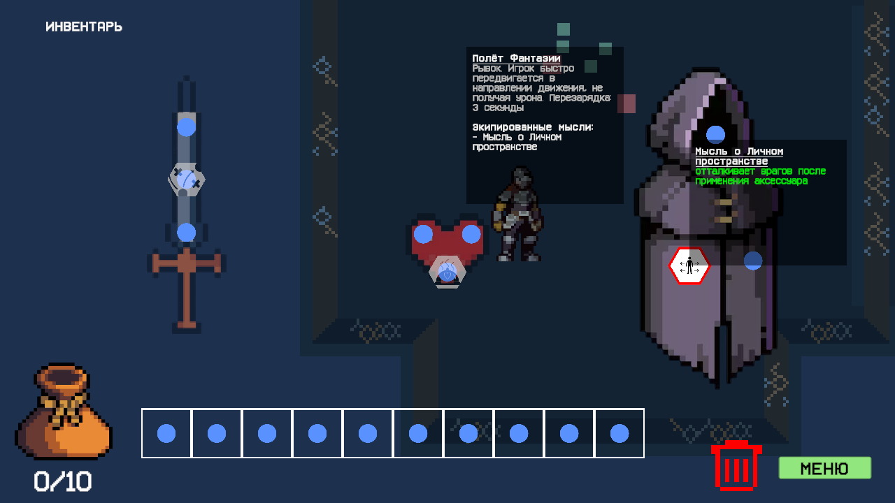
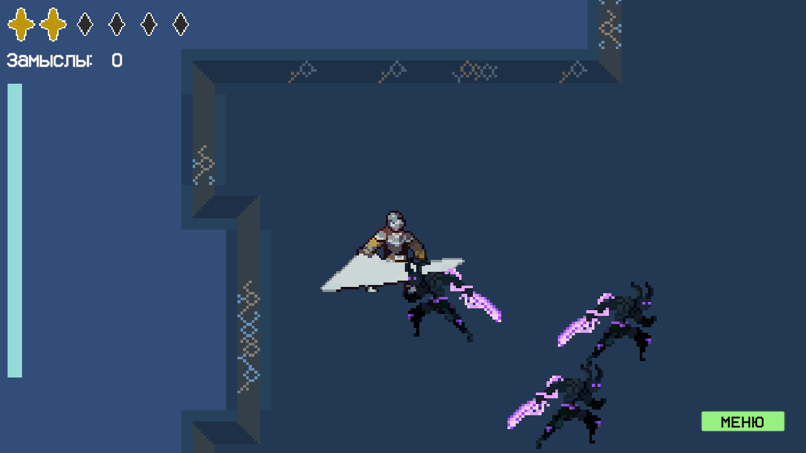
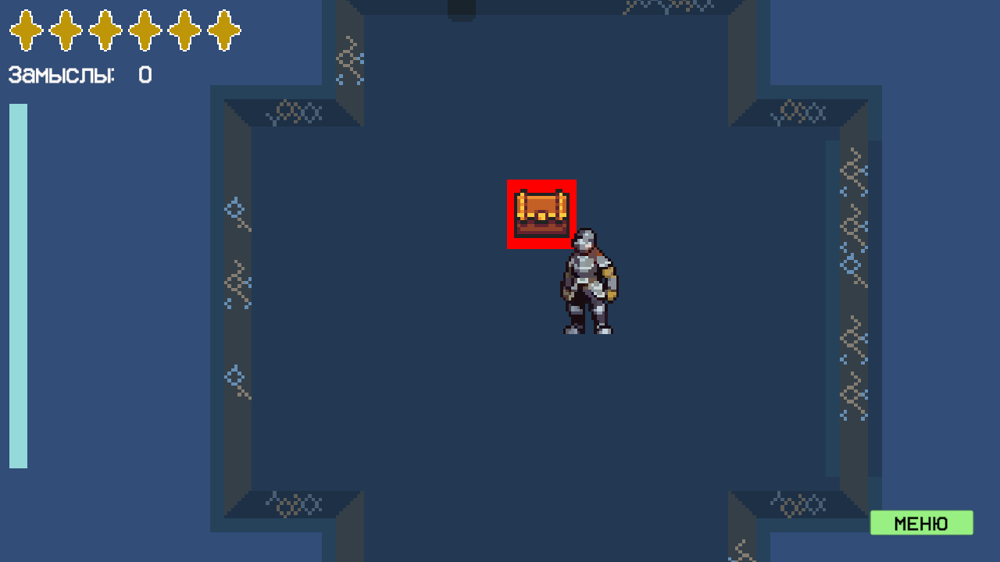

# Inside Ventura

[Назад](./../README.md)

[Билд на itch.io](https://kartofagen.itch.io/inside-ventura)

[Репозиторий](https://github.com/kartofagen/Inside-Ventura)

---

2D top-down action rogue-like про развитие личности.

Это командный проект, в рамках курса МФТИ – «Инновационный практикум» (5 участников, 4 месяца).

---

## Стек технологий

- **Unity 6000.3.9f1** (Unity 6)
- **Universal Render Pipeline (URP)** 17.3.0
- **Unity Input System** 1.18.0
- **DOTween (Demigiant)** - анимации/твины
- Внутренний фреймворк [**CherryFramework**](https://github.com/s1gurd/CherryFramework) (DI/DependencyManager, StateService, SoundService, SaveGameManager, UI-модуль и др.)
- **TextMesh Pro** - UI-текст
- **Cinemachine** 3.1.6
- **Edgar** - процедурная генерация подземелий (dungeon generation)
- **NavMeshPlus** - 2D-навигация для врагов
- **Newtonsoft.Json** - сериализация данных
- **EditorAttributes** - кастомные атрибуты редактора

---

## Моя роль

Моя роль - главный проектировщик архитектуры, геймплейный и UI-программист, в частности:

- **"Thoughts" и "Artifacts"** - спроектировал и реализовал механику мыслей как экипируемых предметов: базовые классы `Thought`, `Effect`, `ModifiableStat`, `DynamicStat`, систему инвентаря мыслей (`ThoughtBag`), а также конкретные мысли (Tactics, Safety, PersonalSpace, Fencing, Dinner) и артефакты (в т.ч. `SwordWeapon`, `Heart`, `DashAccessory`, `ClearProjectilesAccessory`).
- **Player** - визуал персонажа, статы (`PlayerStats`), экипировка (`PlayerEquipment`), инвентарь, здоровье (`PlayerHealth`), система дэша и фреймов неуязвимости (invulnerability frames).
- **Items** - оружие (`Weapon`), аксессуары (`Accessory`), деньги, подбираемые объекты, дроп-система лута с шансами (chances for coin barrel и др.).
- **UI** - экраны инвентаря/меню, тултипы предметов и мыслей, drag&drop, слоты артефактов, адаптивный canvas.
- **Мир и взаимодействия (World/Interactables)** - сундуки, объекты окружения, интеграция с процедурной генерацией подземелий (Edgar).
- Интеграция сторонних пакетов в проект (DOTween, CherryFramework и зависимости).
- Синхронизация звуков с анимациями.

---

## Инструкция по запуску

1. Открыть проект в **Unity Hub**, версия редактора - **6000.3.9f1** (или совместимая с Unity 6).
2. Главная сцена:
   ```
   Assets/_Project/_Development/Scenes/_Production/main.unity
   ```
   Открыть её и нажать **Play**.

Дополнительные тестовые/вспомогательные сцены (для отладки отдельных систем) лежат в `Assets/_Project/_Development/Scenes/_Tests/` и `Assets/_Project/Scenes/`.






