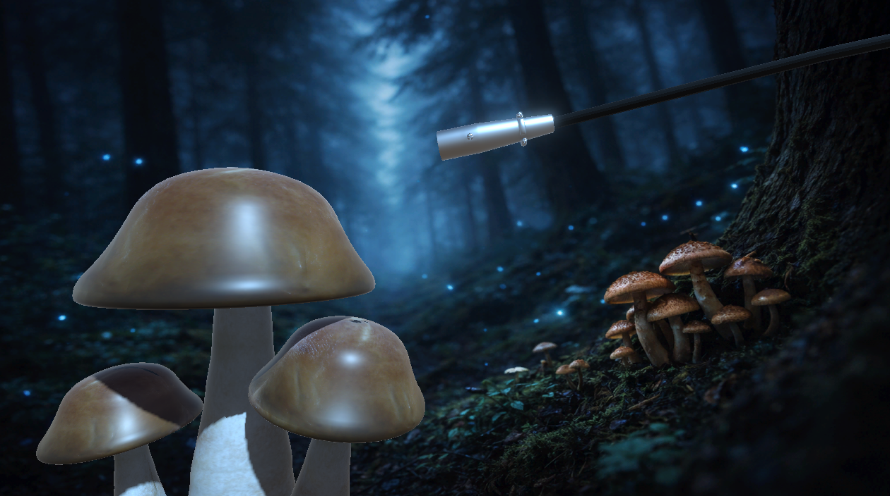
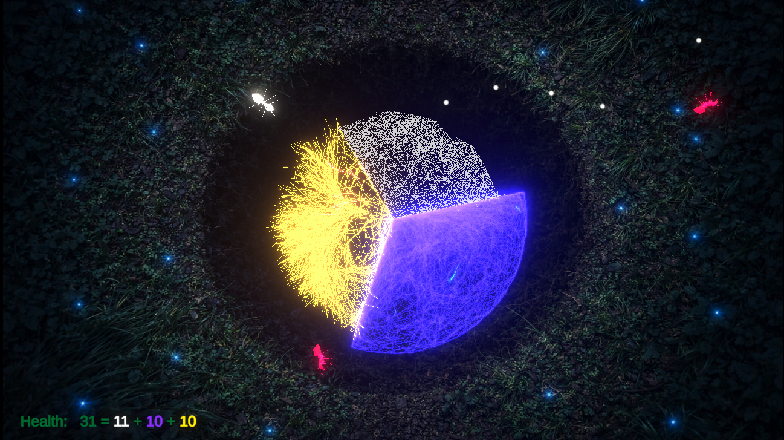
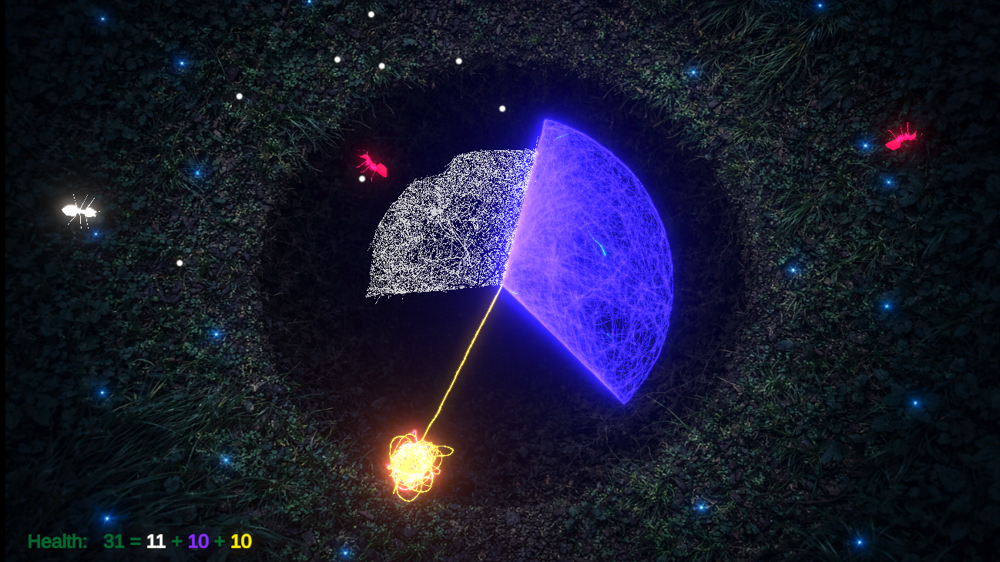
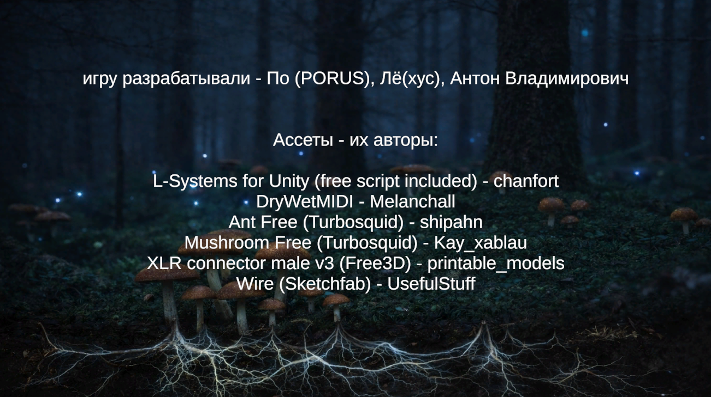

# СПОРОБИТ

[Назад](./../README.md)

[Билд на myindie.ru](https://myindie.ru/games/game/sporobit)

[Репозиторий](https://github.com/kartofagen/ITSGROWING)

---

Музыкальная аркада про защиту мицелия от муравьёв.

Это командный проект на **Game Jam MyIndie Lvl 8** (3 дня, 3 участника).

## Стек технологий

- **Unity 6000.0.28f1** (Unity 6)
- **Render Pipeline:** Universal Render Pipeline (URP) 17.0.3
- **Input:** Unity Input System 1.11.2
- **Навигация:** Unity AI Navigation (NavMesh) 2.0.4
- **UI:** UGUI 2.0.0, TextMesh Pro
- **Аудио/MIDI:** Melanchall.DryWetMIDI - синхронизация геймплея с музыкой в реальном времени

## Моя роль

Один из двух разработчиков проекта (геймдизайнер/программист геймплея). Отвечал за основную игровую механику, боевую систему и синхронизацию геймплея с музыкой:

- **Игрок и управление**
   - `PlayerController.cs`, `BodyRotation.cs`, `FollowCursor.cs` - управление и вращение персонажа
   - `CameraShake.cs` - тряска камеры при попаданиях/атаках

- **Боевая система**
   - `Shield.cs` - механика щита
   - `Projectile.cs`, `ProjectileMovement.cs` - снаряды и их движение
   - `Enemy.cs`, `EnemyHealth.cs`, `EnemyMovement.cs`, `EnemyWaves.cs`, `EnemiesManager.cs` - ИИ противников, волны врагов, менеджмент спавна
   - `BranchHealth.cs`, `BranchHealthManager.cs` - система здоровья веток мицелия
   - `MyceliumEater.cs` - механика поедания мицелия врагами

- **Синхронизация с музыкой (ритм-механики)**
   - `MusicManager.cs`, `AudioRepeat.cs` - управление музыкальным сопровождением
   - `Bass.cs`, `Lead.cs`, `Percussion.cs`, `InstrumentBase.cs` - привязка игровых событий (атаки, спавн врагов) к битам через Melanchall.DryWetMIDI
   - `EnemiesPercussionManager.cs` - синхронизация ударов врагов с ритмом
   - `EatSounds.cs` - звуковые эффекты

- **UI и общая инфраструктура**
   - `HealthDisplay.cs` - отображение здоровья
   - `PauseManager.cs`, `QuitGame.cs` - пауза и выход из игры
   - `DelayedComponentEnabler.cs` - вспомогательная логика инициализации
   - Настройка сцен `Menu.unity`, `Main.unity`, `Credits.unity`, конфигурация `Input Actions`, `ProjectSettings` (URP, физика, тайм-менеджмент)

Также занимался частью визуального контента (спрайты/изображения) и сборкой билда проекта.

> Часть кода в модуле роста мицелия (`Micelium/`) - совместная работа с соавтором (Alexey Lisov), который отвечал за процедурную генерацию 3D-мицелия (`MyceliumTree3D`, `TubeMeshBuilder`).

## Инструкция по запуску

1. Открыть проект в **Unity Hub**, версия редактора - **6000.3.9f1** (или совместимая с Unity 6).
2. Стартовая сцена:
   ```
   Assets/Scenes/Menu.unity
   ```
   Открыть её и нажать **Play**.
3. Порядок сцен в билде: `Menu -> Main -> Credits`.

**Требования:** ПК с поддержкой URP; проект использует нативные библиотеки Melanchall.DryWetMIDI (Windows/macOS x64).






