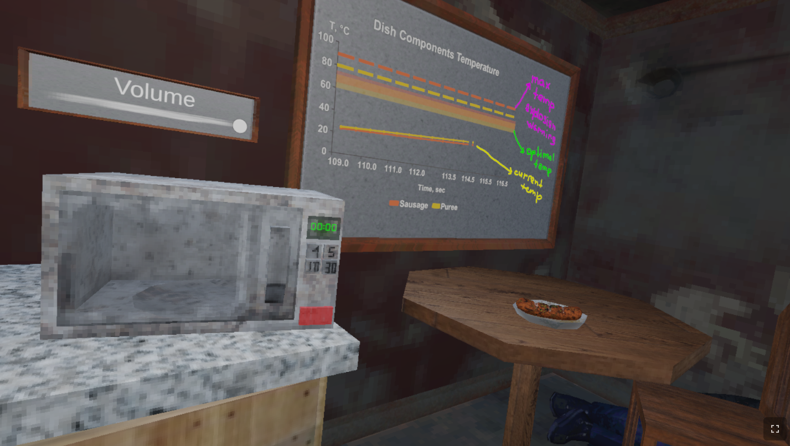
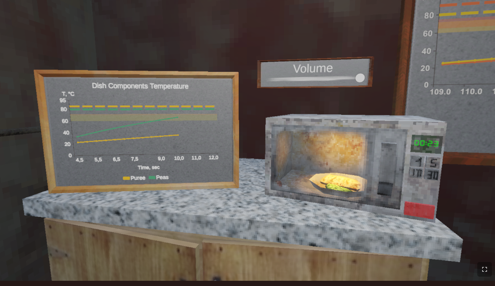
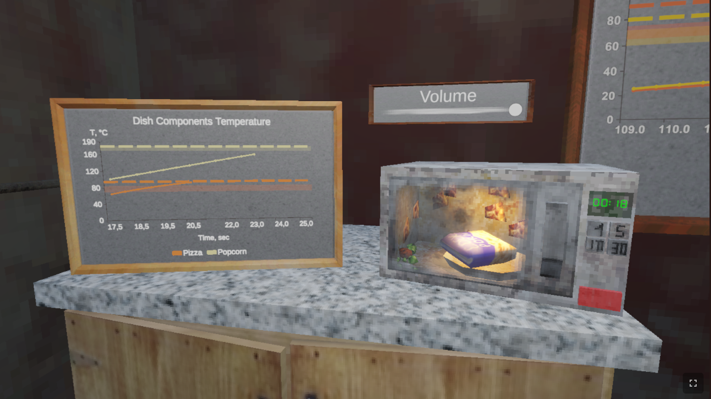
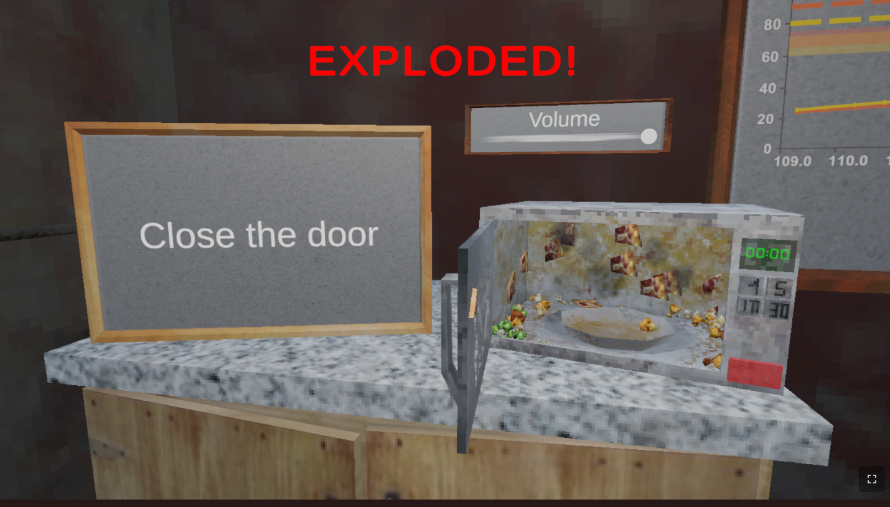

# The Dinner Countdown

[Назад](./../README.md)

[Билд на itch.io](https://kartofagen.itch.io/megavolnovka)

[Репозиторий](https://github.com/kartofagen/GMTK2026)

---

Тайминг-паззл про разогревание блюд в микроволновке.

Это командный проект на **GMTK Game Jam 2026** (4 дня, 4 участника).

---

## Стек технологий

- **Unity 6000.3.9f1** (Unity 6)
- **URP** (Universal Render Pipeline) 17.3.0
- **Zenject** - dependency injection, конфигурация игровых систем
- **DOTween** - твины и анимации
- **XCharts** - визуализация температурных кривых
- **Cysharp R3** - реактивное программирование
- **New Input System** 1.18.0
- **Cinemachine** 3.1.7
- WebGL (игра опубликована как браузерная версия)

## Моя роль

Один из основных программистов команды. Отвечал за игровую логику, связанную с центральной механикой игры - приготовлением блюд в микроволновке:

- **Микроволновка как игровой объект**: управление кнопками (старт/стоп/таймер), вращение двери, звуки открытия/закрытия и работы, таймер приготовления (`MicrowaveTimer` и связанные скрипты).
- **Механики блюд**: перемещение блюд внутрь/наружу микроволновки (`DishMovement`, `MovingInsideSystem`), логика подачи блюд (`DishesServingManager`).
- **Уровни и баланс**: настройка и балансировка уровней, конфигурация через `LevelConfig` и Zenject-инсталлеры (`GameConfigInstaller`), переключение уровней.
- **Экраны результата и рестарт**: победа/поражение, вывод результата (`ResultText`), перезапуск игры (`Restarter`).
- **Внедрение звука**: звуковое сопровождение готовки, взрывов, кнопок, посуды, фоновая музыка и регулятор громкости (`MasterVolumeSlider`, `GroupCookingSound`, `CookingSound` и др.).
- **Интеграция технологий**: подключение и настройка Zenject, DOTween, XCharts в проекте.
- **Сборки**: настройка WebGL-сборки для публикации на itch.io, финальные хотфиксы перед и после джема.

## Инструкция по запуску

1. Открыть проект в **Unity Hub**, версия редактора - **6000.3.9f1** (или совместимая с Unity 6).
2. Главная сцена:
   ```
   Assets/Scenes/Build.unity
   ```
   Открыть её и нажать **Play**.

Прочие сцены в `Assets/Scenes` - тестовые/прототипные, для итоговой игры не используются.






